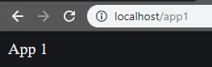

# frontend-server-express
Example - how to create frontend server with Node.js + Express.js

## Install dependencies

```
npm install
```

## Run the applications

```
node app1.js
node app2.js
node frontend-server.js
```

## Go to localhost/app1

App1 should render


